* toc
{:toc .large-only}

# AI Agent란 **무엇인가?**

{: .info-box}
AI Agent는 환경으로부터 정보를 **지각(Perception)** 하고, 주어진 목표를 달성하기 위해 **의사결정(Decision Making)** 을 거쳐 적절한 **행동(Action)** 을 수행하는 지능형 주체이다.

단순히 입력에 반응하는 프로그램과 달리, AI Agent는 데이터와 경험을 바탕으로 학습하며 상황에 맞게 적용한다.

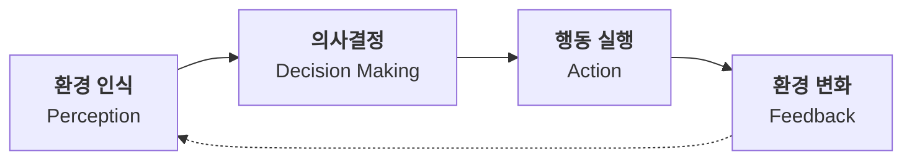

> **핵심 포인트**               
> AI Agent는 단방향이 아니라 **환경과 지속적으로 상호작용** 하는 루프 구조이다.
> "입력 -> 출력"으로 끝나는 일반 프로그램과 가장 큰 차이점이다.

# RAG & MCP - Agent를 강력하게 만드는 기술

## RAG (Retrieval-Augmented Generation)

생성형 AI가 **외부 지식을 검색해 활용** 하는 방식이다. 모델 파라미터에 저장된 정보만으로 답변하지 않고, 관련 문서를 검색(Retrieval)한 뒤 이를 입력 맥락에 포함시켜 답변을 생성(Generation)한다.

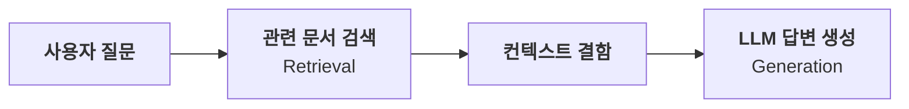

> **효과**
> 1. 학습 이후 최신 정보 활용 가능
> 2. 도메인 특화 지식 접근
> 3. 환각(Hallucination) 감소
> 4. 신뢰도 향상

## MCP (Model Context Protocol)

AI 에이전트가 외부 도구, 서비스, 데이터베이스와 **표준화된 방식으로 연결** 되도록 설계된 프로토콜이다.
기존에는 각 도구마다 개별 API를 맞춰야 했다면, MCP는 공통 인터페이스를 제공해 에이전트가 다양한 리소스를 쉽게 호출할 수 있게 한다.

| 구분 | 기존 방식 | MCP 방식 |
|-------|---------------|-------------------|
|**연결 방식**| 도구별 개별 API 연동 | 표준화된 단일 프로토콜 |
|**코드 복잡도**| 높음 (연동 코드 직접 작성) | 낮음(공통 인터페이스) |
|**확장성**| 새 도구 추가 시 코드 변경 | 플러그인 방식으로 확장 |
|**재사용성**| 프로젝트마다 재작성 | 한 번 구현으로 재사용 |

# 실제 AI Agent 사례

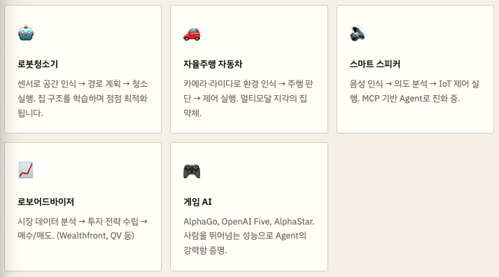

# 워크플로우 종류 - 기본 RAG vs 에이전틱 RAG

같은 RAG라도 에이전트의 자율성을 추가하느냐에 따라 구조가 크게 달라진다.

## 기본 RAG 워크플로우 (직선형)

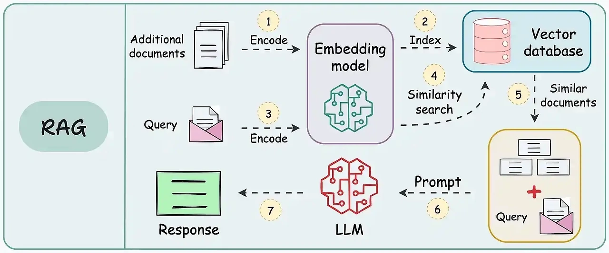

> **특징**        
> 검색과 생성이 고정된 순서로 연결된 **단방향 파이프라인**.       
> 빠르고 단순하며 FAQ, 사내 문서 QA 등 명확한 질의응답에 적합한다.

## 에이전틱 RAG 워크플로우 (반복형)

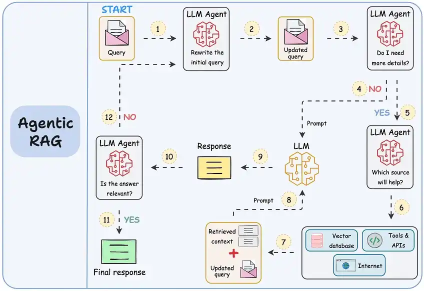

> **특징**        
> LLM이 언제 검색할지, 어떤 도구를 쓸지 **스스로 결정** 한다.       
> 복잡한 리서치, 멀티홉 질의, 장기 과제에 강력한다.

> **멀티홉 질의 (MULTI-HOP QUERY)란?**        
> 단일 질문에 답하기 위해 여러 정보 조각을 **순차적으로 연결해 추론** 해야 하는 질문이다.       
> 예) "2023년 노벨 물리학상 수상자가 근무하던 대학의 설립 연도는?" -> 수상자 검색 -> 소속 대학 검색 -> 설립 연도 검색

| 구분 | 기본 RAG | 에이전틱 RAG |
|------|--------------|----------------|
| **구조** | 직선형 파이프라인 | 다단계・반복형 루프 |
| **검색 횟수** | 항상 1회 | 필요에 따라 여러 번 |
| **쿼리 재작성** | 없음 | 자동 재작성 가능 |
| **적합 태스크** | 단순 FAQ・QA | 복잡한 리서치・멀티홉 |

# LangChain -> LangGraph

## LangChain

LLM 애플리케이션 개발을 돕는 프레임워크.      
프롬프트 관리, 문서 검색, 벡터 DB 연동, 외부 도구 사용 등을 하나의 흐름으로 구성한다.
기본 RAG처럼 **직선형 파이프라인** 에 최적화되어 있다.

## LangGraph

LangChain 생태계의 **그래프 기반 오케스트레이션 프레임워크** 이다.        
노드(작업 단위)와 엣지(흐름)를 그래프 형태로 정의해 분기, 반복, 조건 처리, 에이전트 루프를 명확하게 표현하고 실행한다.

> **LANGGRAPH가 필요한 이유**           
> "검색 -> 답변 생성 -> 자기평가 -> 재검색" 처럼 **루프와 조건 분기가 있는 복잡한 흐름** 은 단순 파이프라인으로 표현하기 어렵다. LangGraph는 이를 그래프 구조로 명확하게 설계・관리할 수 있게 해준다.

## 그래프 구조 이해하기

그래프(Graph)는 **노드(vertex)** 와 그 노드들을 잇는 **간선(edge)** 로 이루어진 데이터 구조이다. 방향이 있으면 방향 그래프(DAG), 없으면 무방향 그래프이다.

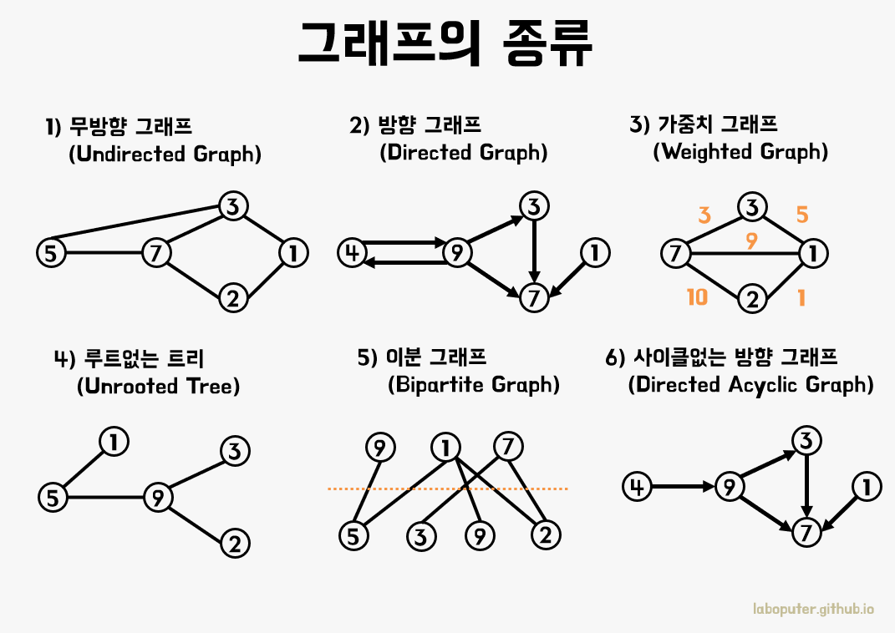

> **그래프 구조 활용 예**       
> 소셜 네트워크 분석・추천 시스템・경로 탐색・지식 그래프・**AI 워크플로우**

# State - 공유 데이터 저장소

State는 워크플로우 실행 중 **유지・공유되는 데이터 저장소** 이다. 사용자 질문, 검색 결과, 현재가지의 답변 초안 등이 상태에 담겨 각 노드가 읽고 쓸 수 있다.

## TypedDict로 State 정의하기

가장 기본적인 방식이다. 키와 타입만 명시하며, 타입 검사 mypy 같은 분석 도구에서만 이루어진다.

```python
from typing import TypedDict

class State(TypedDict):
  question: str
  answer: str

# InputState / OutputState 분리도 가능
class InputState(TypedDict):
  question: str

class OutputState(TypedDict):
  answer: str

class OverallState(InputState, OutputState):
  pass
```

## Pydantic BaseModel로 State 정의하기

런타임에 타입을 엄격하게 검사한다. 잘못된 타입의 데이터가 들어오면 즉시 오류를 발생시킨다.

```python
from pydantic import BaseModel

class User(BaseModel):
  id: int
  name: str
  email: str

# 올바른 사용
user1 = User(id=1, name='김사과', email='apple@apple.com')
```

| 구분 | Typed | Pydantic BaseModel |
|------|---------------|-----------------|
| **타입 검사 시점** | 정적 분석 도구 | 런타임 실행 시점 |
| **잘못된 타입 입력** | 오류 없이 실행됨 | 즉시 ValidationError |
| **성능** | 빠름 | 약간 느림 (검증 비용) |
| **사용 시기** | 간단한 구조 명시 | 데이터 유효성 보장 필요 시 |

## 리듀서(Reducer)로 상태 누적하기

기본 TypedDict는 새 값으로 **덮어쓰기** 합니다. Annotated와 리듀서 함수를 함께 쓰면 **누적 업데이트** 가 가능하다.

```python
from typing import Annotated
from operator import add
from langgraph.graph.message import add_messages
from langchain_core.messages import AnyMessage

# 일반 덮어쓰기 (기본 동작)
class StateV1(TypedDict):
  value: list[str] # 새 값으로 완전 교체

# add 리듀서: 리스트 이어 붙이기
class StateV2(TypedDict):
  value: Annotated[list[str], add] # 기존 리스트에 추가

# add_messages: 대화 메시지 누적 (id 중복 처리 포함)
class StateV3(TypedDict):
  messages: Annotated[]
```

| 구분        | operator.add                          | add_messages                                      |
|------------|--------------------------------------|--------------------------------------------------|
| 대상 타입   | list, int, str 등 범용               | list[BaseMessage] (메시지 객체 전용)             |
| 중복 처리   | 무조건 추가 (Duplicate)              | ID 기반 덮어쓰기 지원 (Upsert)                   |
| 주요 사용처 | 단순 데이터 누적 (로그, 검색 결과)   | 대화 문맥 유지 (Chat Memory)                     |
| 패키지     | import operator                      | from langgraph.graph.message import add_messages |

## 메시지 타입

```python
from langchain_core.messages import HumanMessage, AIMessage, AnyMessage

# HumanMessage: 사용자(사람)의 메시지
user_msg = HumanMessage(content="LangGraph가 뭔가요?")

# AIMessage: AI(LLM)의 메시지
ai_msg = AIMessage(content="LongGraph는 그래프 기반 AI 워크플로우 프레임워크이다.")

# add_messages는 메시지 병합 시 동일 id의 메시지를 업데이트 처리
```

# Node - 개별 작업 단위

노드는 LangGraph 워크플로우 안에서 실행되는 **개별 작업 단위** 입니다. State를 입력받아 특정 로직을 실행한 뒤 새로운 상태 값을 딕셔너리로 반환한다.

```python
from langgraph.graph import StateGraph, START, END
from typing import Annotated
from operator import add

class State(TypedDict):
  messages: Annotated[list[str], add]

# 노드는 State를 받아 업데이트할 딕셔너리를 반환하는 함수
def chatbot(state: State):
  answer = "안녕하세요! 무엇을 도와드릴까요?"
  return {"messages": [answer]}

# 그래프에 노드 등록
graph = StateGraph(State)

graph.add_node("chatbot", chatbot) # 이름, 함수

graph.add_edge(START, "chatbot")
graph.add_edge("chatbot", END)
graph = graph.compile()
print(graph)
```

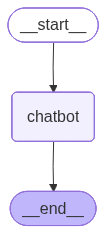

```python
graph.invoke({"messages": ["안녕"]})
```

```
Answer :  안녕하세요! 무엇을 도와드릴까요?
{'messages': ['안녕', '안녕하세요! 무엇을 도와드릴까요?']}
```

## 노드 순차 연결 예시

```python
class State(TypedDict):
  value_1: str
  value_2: int

def step_1(state: State):
  return {"value_1": state["value_1"]}

def step_2(state: State):
  return {"value_1": state["value_1"] + " b"}

def step_3(state: State):
  return {"value_2": 10}

graph = StateGraph(State)
graph.add_node(step_1)
graph.add_node(step_2)
graph.add_node(step_3)

graph.add_edge(START, "step_1")
graph.add_edge("step_1". "step_2")
graph.add_edge("step_2", "step_3")
graph = graph.compile()
print(graph)

# add_sequence로 한 번에 연결도 가능
graph = StateGraph(State).add_sequence([step_1, step_2, step_3])
```


```python
graph.invoke({"value_1": "apple"})
```

```
{'value_1': 'apple b', 'value_2': 10}
```

## 실행 방식: invoke / stream / ainvoke

```python
# invoke: 결과가 나올 때까지 기다림 (동기)
result = graph.invoke({"messages": [input_message]})

# ainvoke / astream: 비동기 처리
result = await graph.ainvoke({"messages": [input_message]})

# stream: 중간 결과를 실시간으로 받음
# stream_mode="values" -> 각 단계의 현재 전체 상태
# stream_mode="updates" -> 각 단계에서 업데이트된 값만 (기본값)
# stream_mode="messages" -> 메시지 토큰 단위 스트리밍
for chunk in graph.stream({"messages": [input_message]}, stream_mode="values"):
  chunk["messages"][-1].pretty_print()
```

# Edge - 노드 간 흐름 연결

{: .info-box}
엣지는 노드와 노드를 연결하는 **흐름 경로** 이다. "다음에 무엇을 실행할지" 를 결정한다.

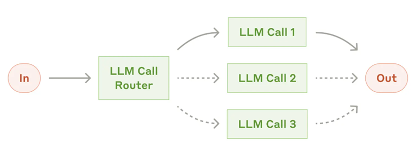

> "실선"은 기본 엣지이고, "점선"은 조건부 엣지이다.

## 기본 엣지 (Normal Edge)

A 노드가 끝나면 무조건 B 노드로 이동한다.

```python
graph.add_edge("node_a", "node_b") # A -> B 고정 연결
graph.add_edge(START, "first_node")
graph.add_edge("last_node", END)
```

## 조건부 엣지 (Conditional Edge)

라우팅 함수의 반환값에 따라 다른 노드로 분기한다.

```python
def routing_function(state: State):
  if state["input"] == "isroute":
    return "node_b" # b로 이동
  return "node_c" # c로 이동

graph.add_conditional_edges(
  "node_a",         # 어느 노드 다음에
  routing_function, # 라우팅 함수
  {                 # 반환값 -> 다음 노드 매핑
    "node_b": "node_b",
    "node_c": "node_c"
  }
)
```

# 흐름 패턴 모음

## 병렬 실행 패턴

하나의 노드에서 여러 노드로 동시에 분기해 병렬로 처리한다.

```python
# aggregate 리듀서로 병렬 결과 수집
class State(TypedDict):
  aggregate: Annotated[list, operator.add]
  
# a -> (b와 c 동시 실행) -> d
graph.add_edge(START, "a")
graph.add_edge("a", "b") # b와 c를 동시에
graph.add_edge("a", "c")
graph.add_edge("b", "d")
graph.add_edge("c", "d")
graph.add_edge("d", END)

graph.invoke({"aggregate": []})
# a->b, a->c 병렬 실행 -> d에서 결과 합산
```

### graph

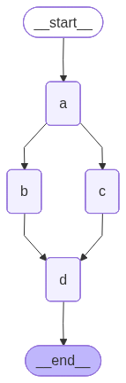

### invoke 실행 결과

```
{'aggregate': ['A', 'B', 'C', 'D']}
```

## 루프 (반복) 페탄

조건을 만족할 때까지 특정 노드를 반복 실행한다.

```python
def route(state: State):
  if len(state['aggregate']) < 7:
    return 'b'    # 아직 부족 -> 다시 b로
  else:
    return END    # 충분 -> 종료

graph.add_edge(START, "a")
graph.add_conditional_edges("a", route)
graph.add_edge("b", "a")  # b 끝나면 다시 a로

# 무한루프 방지: recursion_limit 설정
from langgraph.errors import GraphRecursionError
try:
  graph.invoke({"aggregate": []}, config={"recursion_limit": 4})
except GraphRecursionError: # 반복 종료 조건에 도달할 수 없는 경우
  print("Recursion Error")
```

### graph

<div style="display: grid; grid-template-columns: 1fr 1fr; column-gap: 10%;">
  
  
</div>

### 실행 결과

```
Node A 처리 중 현재 상태값 : []
Node B 처리 중 현재 상태값 : ['A']
Node A 처리 중 현재 상태값 : ['A', 'B']
Node B 처리 중 현재 상태값 : ['A', 'B', 'A']
Recursion Error
```

## Human-in-the-loop 패턴

사용자 입력에 따라 루프를 계속할지 종료할지 결정한다.

```python
class State(TypedDict):
  human_messages: Annotated[list[HumanMessage], add_messages]
  ai_messages: Annotated[list[AIMessage], add_messages]
  retry_num: int

def route(state: State):
  # 메시지에 "반복"이 있으면 재시도 노드로
  if "반복" in state["human_messages"][-1].content:
    return "retry"
  else:
    return END

graph.add_conditional_edges("chatbot", route)
graph.add_edge("retry", "chatbot") # 재시도 -> 챗봇으로 돌아감
```

## 조건 분기 + 병렬 패턴

```python
def route_bc_or_cd(state: State) -> sequence[str]:
  # 조건에 따라 실행할 노드 목록 반환
  if state["which"] == "cd":
    return ["c", "d"] # c와 d 병렬 실행
  return ["b", "c"] # b와 c 병렬 실행

intermediates = ["b", "c", "d"]
graph.add_conditional_edges("a", route_bc_or_cd, intermediates)
```

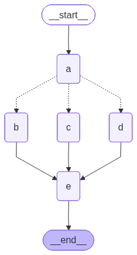

# 복습 퀴즈

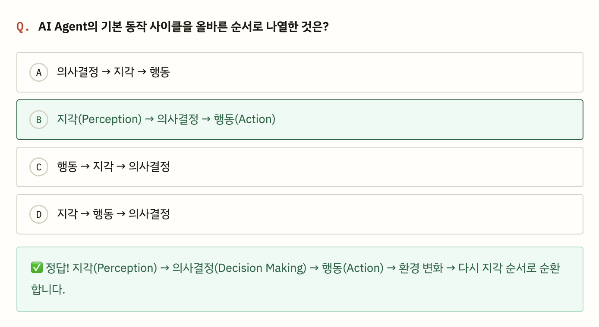
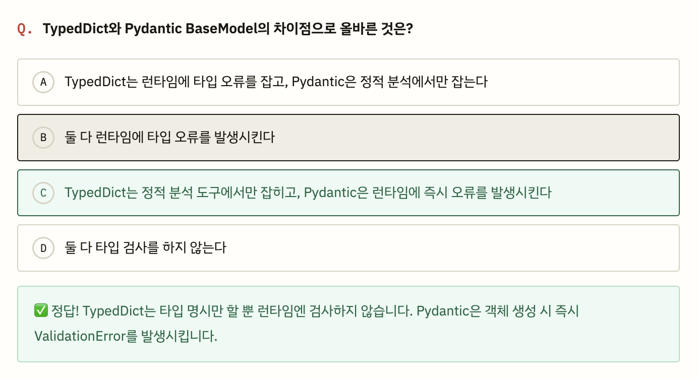
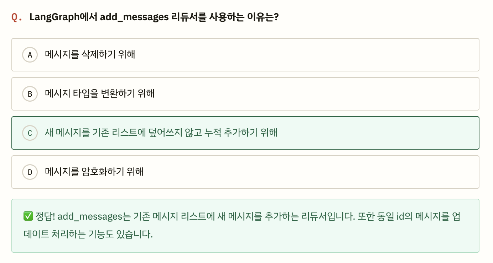
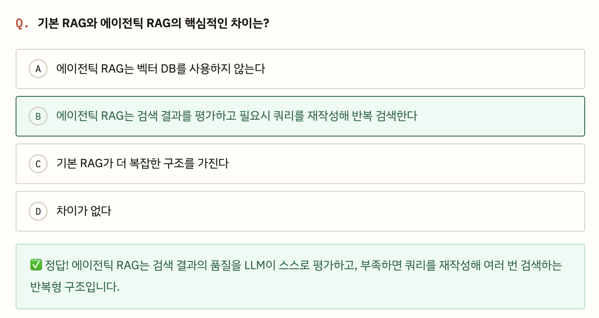