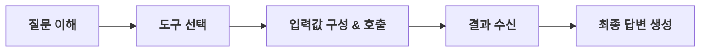

* toc
{:toc .large-only}

# Tool Calling Agent란?

자신의 지식만 사용하는 것이 아니라, **외부 도구(API, DB 코드 실행기 등)를 직접 호출** 해 문제를 해결하는 에이전트이다.



> **일반 LLM VS TOOL CALLING AGENT**          
> 일반 LLM은 학습된 지식으로만 답변한다.      
> Tool Calling Agent는 "계산기, 검색엔진, DB 조회, 코드 실행기" 를 필요할 때        
> 직접 사용해 **실시간 최신 정보와 정확한 계산** 이 가능하다.

# Tavily - AI용 웹 검색 API

웹을 실시간으로 검색해 AI가 최신・정확한 정보를 답변할 수 있도록 돕는 AI 전용 검색 API 플랫폼이다.

> **API 키 발급**       
> https://app.tavily.com/home 에서 무료 키 발급 가능

## Tavily 기본 사용법

```python
from tavily import TavilyClient

client = TavilyClinet()

# 기본 검색 - 결과 딕셔너리 반환
response = client.search("What is AI Agent?", max_results=3)
results = response['results'] # 검색 결과 리스트

# get_search_context - 검색 결과를 하나의 텍스트로 압축
context = client.get_search_context(query='What is AI Agent?')

# qna_search - 한두 문장으로 정리된 최종 답변
answer = client.qna_search(query='What is AI Agent?')
```

## LangChain용 TavilySearch 도구

> **TavilySearch에 관한 문서:**           
> https://docs.langchain.com/oss/python/integrations/tools/tavily_search

```python
from langchain_tavily import TavilySearch

tool = TavilySearch(max_results=3)

# 문자열로 직접 호출
tool.invoke("What's a 'node' in LangGraph?")

# tool_call 형식으로 호출 (ToolNode 연동 시 사용)
tool.invoke({
  "args": {'query': "What's a 'node' in LangGraph?"},
  "type": "tool_call",
  "id": "foo",
  "name": "tavily_search"
})
```

# 커스텀 도구 만들기

`@tool` 데코레이터로 일반 Python 함수를 LangChain 도구로 변환한다. **함수의 docstring** 이 LLM이 도구를 선택하는 근거가 된다.

```python
from langchain_core.tools import tool

@tool
def add(a: int, b: int) -> int:
  """Add two integers and return the results."""
  return a + b

@tool
def multiply(a: int, b: int) -> int:
  """Multiply two integers and return the results."""
  return a * b

tools = [add, multiply]

# 영화 정보 조회 도구 얘시 (Literal로 입력 제한)
from typing import Literal

@tool
def get_movieinfo(movie: Literal['메멘토', '인터스텔라']):
  '''아래 설명은 영화에 대한 내용이야. 꼭 참고해줘.'''
  if movie == '메멘토':
        return "메멘토는 단기 기억 상실증을 가진 주인공이 아내 살해 사건의 진실을 찾기 위해 메모와 문신에 의존해 사건을 추적하는 독특한 구조의 스릴러 영화입니다."
  elif movie == '인터스텔라':
      return "인터스텔라는 인류의 미래를 구하기 위해 우주로 떠난 탐사대가 사랑과 시간, 과학의 한계를 넘어서며 펼치는 감동적인 SF 영화입니다."
  else:
      raise AssertionError('알 수 없는 영화')
```

> **DOCSTRING의 역할**          
> LLM은 docstring을 읽고 "이 도구가 언제 필요한지" 판단한다. 
> **명확하고 구체적인 docstring** 이 도구 선택 정확도를 높인다.

# 도구 바인딩 (bind_tools)

LLM에 도구 목록을 등록해 모델이 필요할 때 선택해 호출할 수 있게 한다.

```python
from langchain_openai import ChatOpenAI

llm = ChatOpenAI(model='gpt-5.4-2026-03-05')

# 도구 바인딩 - 모델이 알아서 필요한 도구 선택
llm_with_tools = llm.bind_tools(tools)

# 수학 문제 -> 도구 호출 발생
query = "What is 3 * 12? Also, What is 11 + 49?"
response = llm_with_tools.invoke(query)
print(response.tool_calls)
# [{'name': 'multiply', 'args': {'a': 3, 'b': 12}, ...},
# {'name': 'add', 'args': {'a': 11, 'b': 49}, ...}]

# 도구가 필요 없는 질문 -> tool_calls = []
query2 = "What is 12 % 2?"
response2 = llm_with_tools.invoke(query2)
print(response2.tool_calls) # 모델이 자체 계산
# []

# 특정 도구 강제 호출 (tool_choice)
llm_forced = llm.bind_tools(tools,
  tool_choice={'type': 'function', 'function': {'name': 'multiply'}}
)
```

> **AIMESSAGE 구조**
> 도구 호출이 있으면 response.tool_calls에 [{'name': 도구명, 'args': {...}, 'id': '...', 'type': 'tool_call'}] 형태로 담긴다. content는 비어있을 수 있다.

# ToolNode 구현

LangGraph에서 LLM의 tool_calls를 읽어 실제 도구를 실행하고 결과를 ToolMessage로 반환하는 노드이다.

## BasicToolNode - 직접 구현

```python
import json
from langchain_core.messages import ToolMessage

class BasicToolNode:
  def __init__(self, tools: list) -> None:
    # 도구 이름으로 빠르게 찾기 위한 딕셔너리
    self.tools_by_name = {tool.name: tool for tool in tools}

  def __call__(self, inputs: dict):
    messages = inputs.get("messages", [])
    message = messages[-1]    # 마지막 AIMessage

    outputs = []
    for toll_call in message.tool_calls:
      # 도구 이름으로 찾아서 인자와 함께 실행
      tool_result = self.tools_by_name[tool_call]["name"].invoke(
        tool_call['args']
      )
      outputs.append(ToolMessage(
        content=json.dumps(tool_result), # json.dumps(): json 형식의 문자열로 반환
        name=tool_call['name'],
        tool_call_id=tool_call['id']
      ))
    return {"messages": outputs}
```

## LangGraph 내장 ToolNode 사용 (권장)

### 표준화된 실행 인터페이스

{: .info-box}
에이전트가 도구를 호출할 때(Tool Calling), LLM은 실행 결과가 아니라 **"어떤 도구를 어떤 파라미터로 실행해달라"**는 '호출 의도'만 전달한다.

{: .star-list}
- **직접 구현 시:** 에이전트의 메시지에서 `tool_calls`를 일일이 파싱하고, 매칭되는 함수를 실행한 뒤, 그 결과를 다시 ToolMessage 객체로 감싸서 State에 추가하는 복잡한 과정을 직접 코딩해야 한다.
- **ToolNode 사용 시:** 미리 정의된 함수 리스트만 넘겨주면, 이 모든 파싱-실행-메시지 생성 과정을 자동으로 처리합니다.

### 멀티 툴 호출의 병렬 처리 (Parallel Execution)

{: .info-box}
최신 모델(Gemini 1.5, GPT-4o 등)은 한 번에 여러 개의 도구를 호출할 수 있다. (예: "시부야 날씨랑 맛집 동시에 찾아줘")

{: .star-list}
- **효율성:** ToolNode는 여러 개의 도구 호출이 들어오면 이를 **병렬로 실행** 하여 응답 속도를 최적화한다. 직접 루프를 돌며 하나씩 실행하는 것보다 훨씬 빠르다.
- **데이터 정합성:** 각 도구 실행 결과에 고유한 `tool_call_id`를 부여하여 **대화 내역이 섞이지 않도록 관리** 해 줍니다.

### 유연한 에러 핸들링 (Error Resilience)

{: .info-box}
도구 실행 중 에러가 발생했을 때, 시스템 전체가 멈추지 않게 하는 것이 중요하다.

{: .star-list}
- **복구 로직:** `ToolNode`는 실행 중 발생한 예외(Exception)를 포착하여 에러 메시지를 담은 ToolMessage를 생성한다.
- **에이전트 피드백:** 이 에러 메시지를 본 LLM은 "아, 파라미터가 잘못됐구나" 혹은 "서버가 응답을 안 하네"라고 인지하고 
스스로 수정한 뒤 재시도하거나 다른 대안을 제시할 수 있다.

### 상태(State)와의 완벽한 통합

{: .info-box}
ToolNode는 LangGraph의 State 구조를 완벽히 이해하고 설계되었다.

{: .star-list}
- **자동 업데이트:** 실행 결과가 나오면 `add_messages` 리듀서와 연동되어 대화 기록에 즉시, 그리고 안전하게 업데이트된다.
- **체크포인트 지원:** 중간에 도구 실행이 실패하거나 중단되어도, `ToolNode`가 만든 메시지 덕분에 이전 상태로 정확히 되돌아갈 수(Time Travel) 있다.

```python
from langgraph.prebuilt import ToolNode
from langchain_tavily import TavilySearch
from langchain_openai import ChatOpenAI
from langchain.graph import StateGraph, START, END
from langgraph.graph.message import add_messages
from typing import Annotated

tool = TavilySearch(max_results=2)
tools = [tool]
llm_with_tools = ChatOpenAI(model='gpt-5.4-2026-03-05').bind_tools(tools)

class State(TypedDict):
  messages: Annotated[list, add_messages]

def chatbot(state: State):
  return {"messages": [llm_with_tools.invoke(state['messages'])]}

# 조건부 라우팅: tool_calls 있으면 tools 노드로
def route_tools(state: State):
  ai_message = state["messages"][-1]
  if hasattr(ai_message, "tool_calls") and len(ai_message.tool_calls) > 0:
    return "tools"
  return END

graph = StateGraph(state)
graph.add_node("chatbot", chatbot)
graph.add_node("tools", ToolNode(tools=[tool]))

graph.add_edge(START, "chatbot")
graph.add_conditional_edges("chatbot", route_tools)
graph.add_edge("tools", "chatbot") # 도구 실행 후 다시 LLM으로
graph = graph.compile()
```

### graph


## 스트리밍 챗봇으로 실행

```python
def stream_graph_updates(user_input: str):
  for event in graph.stream({"messages": [{"role": "user", "content": user_input}]}):
    for value in event.values():
      print("Assistant": value['messages'][-1].content)

while True:
  user_input = input("User: ")
  if user_input.lower() in ['quit', 'exit', 'q']:
    break
  stream_graph_updates(user_input)
```

### 출력 결과

```
User: 서울
User:  서울
Assistant:  안녕하세요!  
“서울”에 대해 무엇을 원하시나요?

예를 들면:
- 서울 날씨
- 서울 맛집
- 서울 관광지 추천
- 서울 지도 / 구 정보
- 서울 역사
- 서울 집값 / 생활 정보

원하시는 내용을 짧게 말씀해 주세요.
User: q
User:  q
Goodbye!
```

# create_react_agent - ReAct 패턴

`ReAct(Reason + Act)` 패턴을 따르는 에이전트를 한 줄로 생성한다. 
**"생각 -> 도구 호출 -> 관찰 -> 최종 답변"** 의 반복 루프를 자동으로 처리한다.

```python
from langgraph.prebuilt import create_react_agent
from langchain_openai import ChatOpenAI
from langchain_tavily import TavilySearch

tool = TavilySearch(max_results=2)
llm = ChatOpenAI(model='gpt-5.4-2026-03-05')

# LLM + 도구 목록만 넘기면 ReAct 에이전트 완성!
agent = create_react_agent(llm, [tool])

response = agent.invoke({
  "messages": [{"role": "user", "content": "What is LangGraph?"}]
})
```

> **REACT 루프 흐름**           
> #161b22, #79c1ff, #878f9a, #e6edf3