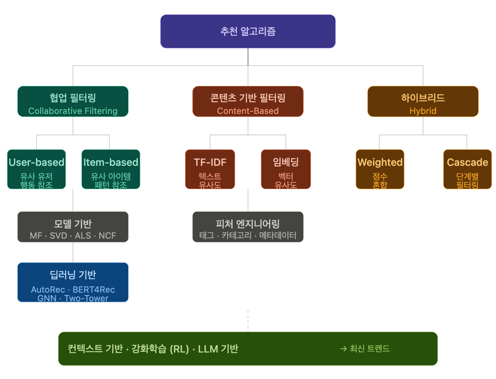

* toc
{:toc .large-only}

## 🗺️ 추천 알고리즘 큰 그림

# 협업 필터링 (Collaborative Filtering)

"나와 비슷한 사람이 좋아한 것을 나도 좋아할 것이다."
유저 - 아이템 상호작용 데이터(평점, 클릭, 구매)만으로 추천

### User-based Collaborative Filtering

## User-based CF

## Item-based CF

## Matrix Factorization (SVD, ALS)

## Neural Collaborative Filtering (NCF)

# 콘텐츠 기반 필터링 (Content-Based Filtering)

## TF-IDF + Cosine 유사도

## 아이템 임베딩 기반

# 하이브리드 (Hybrid)

## Weighted Hybrid

## Cascade Hybrid

# 최신 기법

## Two-Tower 모델

## GNN 기반 (LightGCN)

## 강화학습 기반

## LLM 기반
